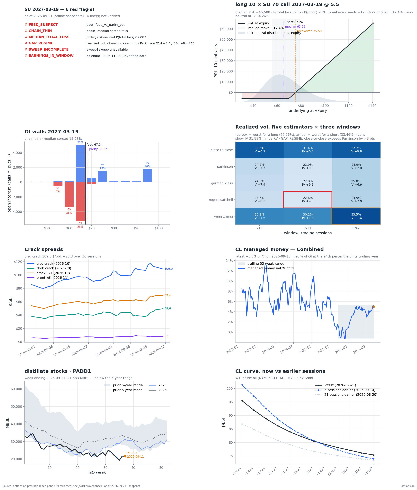
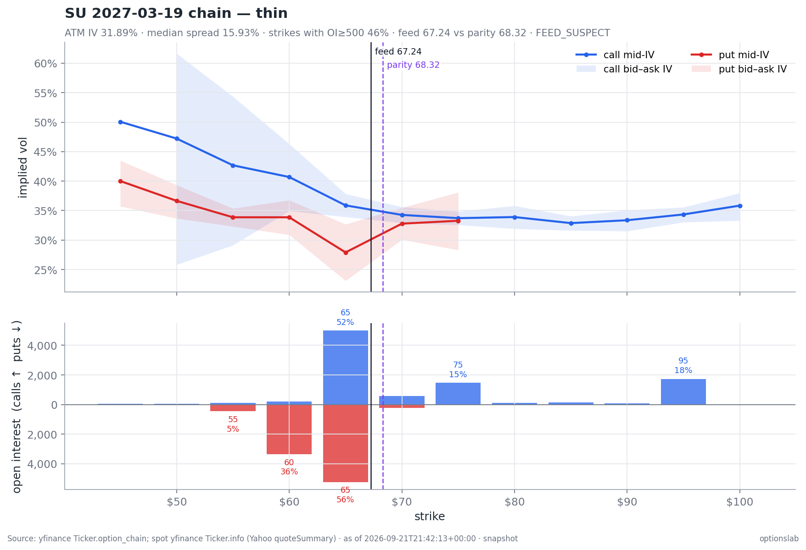
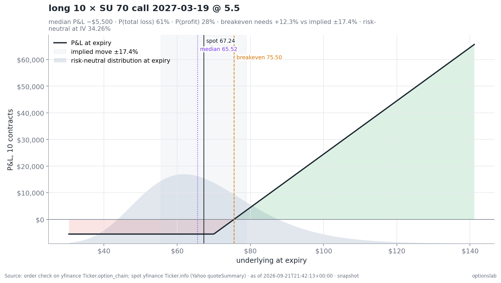
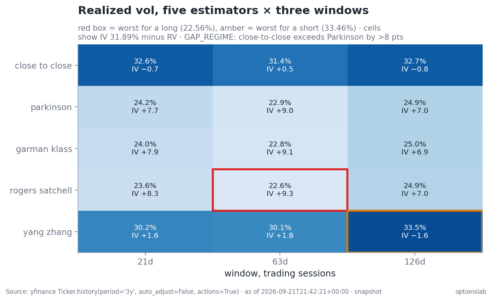
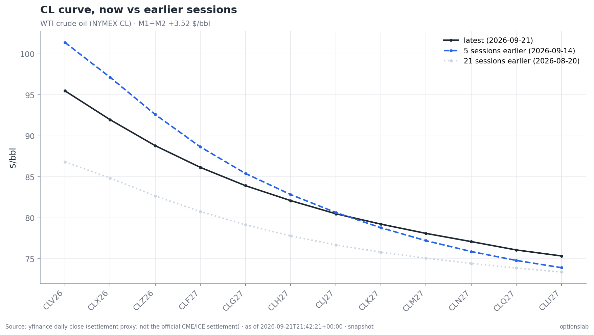
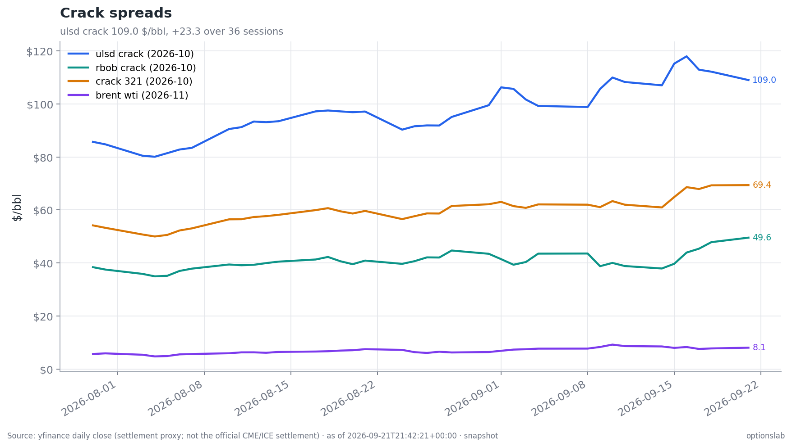
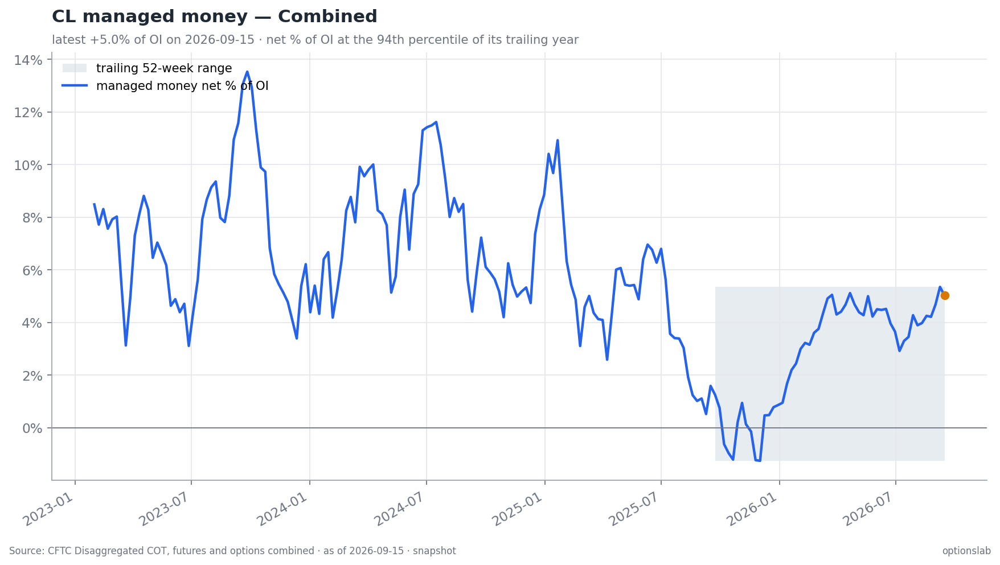
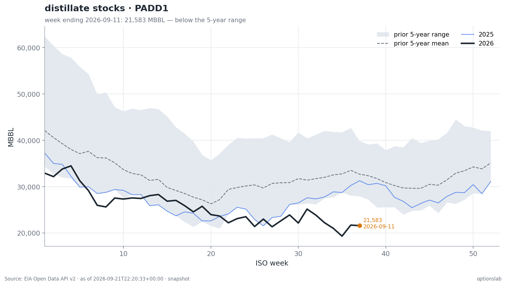

<h1 align="center">optionslab</h1>

<p align="center"><em>Options and energy-market analytics that refuse to make up numbers.<br>
A Python library, a CLI, and an MCP server for Claude — every number with a source, a timestamp, and a quality flag.</em></p>

<p align="center">
  <a href="LICENSE"></a>
  <a href="https://www.python.org/downloads/"></a>
  <a href="https://github.com/pradhann/options-chain-mcp/actions/workflows/ci.yml"></a>
  <a href="https://modelcontextprotocol.io"></a>
  <a href="https://github.com/astral-sh/ruff"></a>
</p>

<p align="center"></p>

---

## Why this exists

Most trading mistakes that look like bad calls are really bad inputs: a stale spot from a
delayed feed, an after-hours `0.00` bid priced as a leg, an earnings date remembered wrong,
a roll yield asserted rather than read off the curve, a convertible nobody searched for.

`optionslab` is built around one rule:

> **A number the tool cannot source is a number it does not return.**
> It returns `not_verified`, the reason, and a link you can check by hand instead.

Every result is an envelope:

```json
{
  "status": "ok | partial | not_verified",
  "provenance": {"asof": "2026-09-21T19:45:00+00:00", "source": "CFTC Disaggregated COT, futures and options combined",
                 "source_url": "https://publicreporting.cftc.gov/...", "session": "regular", "quality": "live"},
  "data": { "...": "..." },
  "warnings": ["..."],
  "not_verified": [{"item": "BZ release_date", "reason": "ICE publishes no parseable schedule", "url": "https://www.ice.com/report/122"}]
}
```

Missing is `null`, never zero. Nothing is interpolated, estimated, or taken from memory.

## What you get

**One command before any trade:**

```bash
optionslab pretrade SU 2027-03-19 --order '{"symbol":"SU","instrument":"call","side":"long","qty":10,"strike":70,"expiration":"2027-03-19"}'
```

```text
RED FLAGS (6)
  ✗ FEED_SUSPECT           [spot] feed_vs_parity_pct
  ✗ CHAIN_THIN             [chain] median spread fails
  ✗ MEDIAN_TOTAL_LOSS      [order] risk-neutral P(total loss) 0.6087
  ✗ GAP_REGIME             [realized_vol] close-to-close minus Parkinson 21d +8.4 / 63d +8.4 / 126d +7.8 vol pts
  ✗ SWEEP_INCOMPLETE       [sweep] sweep unavailable   (set OPTIONSLAB_SEC_UA to run it)
  ✗ EARNINGS_IN_WINDOW     [calendar] 2026-11-03 (unverified date)

ORDER  ok  [snapshot · 2026-09-21T21:42:13+00:00 · yfinance Ticker.option_chain ...]
  long 10 x 70 call 2027-03-19: bid 5 ask 5.5 -> fill 5.5, premium 5,500
  liquidity: 1.75% of strike OI 573, spread 9.52%, round trip 500
  hurdle: breakeven move 12.28% vs implied move 17.4% (ATM straddle mid / spot, to expiry)
  odds (risk-neutral): median P&L -550/contract, P(total loss) 61%, P(profit) 28%
  vol: IV 34.26% = worst-for-long RV 22.56% + 11.7 pts
...
```

The page, in the order a trade gets checked:

| Section | What it answers | Source |
|---|---|---|
| **spot** | Is the feed spot right? Feed vs CBOE vs put-call-parity spot; `FEED_SUSPECT` above 1% | yfinance, CBOE delayed quotes |
| **chain** | Is the chain tradeable? Median spread, OI depth, verdict, OI walls, ATM IV | yfinance option chain |
| **order** | What am I paying for? Fill, size vs strike OI, spread cost, breakeven vs implied move, risk-neutral median / P(total loss) / P(profit), IV vs every RV cell | the chain snapshot |
| **realized_vol** | How much does it actually move? 5 estimators × 21/63/126 days, worst cells named, gap regime | 3 years of daily bars |
| **crack** | ULSD, RBOB, 3-2-1, Brent−WTI on matching delivery months, 5/21-session change | NYMEX month contracts |
| **physical** | Configured EIA series (e.g. PADD 1 distillate) vs its 5-year seasonal band | EIA API v2 |
| **positioning** | Managed-money net, % of OI, 1y/3y percentile, print and release dates, staleness | CFTC, ICE |
| **sweep** | Converts, warrants, ATM programs, hedges, variable dividends, buybacks, insider trades, share count — with 400-character excerpts and filing links | SEC EDGAR full-text search |
| **calendar** | Every dated event to expiry — earnings (two sources), ex-div, EIA, CFTC, FOMC, OPEC+, futures expiries, ETF roll windows — each with a URL and `verified` | official calendar pages |
| **markets** | Prediction-market odds with the exact resolution text | Polymarket Gamma API |
| **book** | Delta-notional per name, options and stock together, before and after the order, vs your cap | your ledger + chains |

**And the same page as one chart sheet** (`optionslab plot sheet SU 2027-03-19 --order ...`):

<p align="center"></p>

## Install

```bash
git clone https://github.com/pradhann/options-chain-mcp
cd options-chain-mcp
python -m venv .venv && source .venv/bin/activate
pip install -e ".[dev]"
```

Python 3.12+. No paid data, no API keys required to start.

### Two optional settings (both free)

| Variable | Why |
|---|---|
| `OPTIONSLAB_SEC_UA="Your Name you@example.com"` | SEC requires a contact in the User-Agent; `www.sec.gov` refuses requests without one, so the filing sweep stays `not_verified` until you set it. |
| `EIA_API_KEY=...` | EIA's `DEMO_KEY` works but is rate limited. [Register a free key](https://www.eia.gov/opendata/register.php). |

## Quick start (CLI)

```bash
# the pre-trade page (add --json for the full envelope)
optionslab pretrade VLO 2027-01-15

# the chart sheet and single charts -> .optionslab/charts/*.png
optionslab plot sheet VLO 2027-01-15
optionslab plot chain VLO 2027-01-15     # IV smile with bid/ask bands over OI walls
optionslab plot rv VLO 2027-01-15        # the 15-cell realized-vol heatmap vs ATM IV
optionslab plot curve CL                 # futures curve now vs 5 and 21 sessions ago
optionslab plot cracks
optionslab plot cot CL
optionslab plot order --order '{"symbol":"VLO","instrument":"call","side":"long","qty":5,"strike":180,"expiration":"2027-01-15"}'

# any single feed as JSON
optionslab feed --help
optionslab feed chain VLO 2027-01-15
optionslab feed rv-matrix VLO
optionslab feed prompt-spread CL
optionslab feed eia distillate_stocks PADD1
optionslab feed cot HO
optionslab feed sweep VLO
optionslab feed calendar 2026-09-21 2027-01-15
optionslab feed polymarket-search hormuz

# jobs
optionslab refresh-all        # snapshot every feed for your watchlist + open positions (run 15:45 ET)
optionslab weekly-check       # the Sunday read: prompt spreads, EIA, COT staleness, Form 4s, next 45 days, alerts

# the ledger (append-only CSV at .optionslab/ledger.csv)
optionslab ledger open --symbol VLO --instrument call --side long --strike 180 --expiration 2027-01-15 \
  --thesis T-014 --exit-condition "close below 150 or crack < 25" --recommended 5 --executed 5 --price 7.40
optionslab ledger marks       # P&L and delta-notional per name, from the chain snapshots
optionslab ledger close --id 3f9a1c2e --price 12.10 --outcome win --right-for-reason yes --autopsy "crack widened as argued"
optionslab ledger review      # closed trades with no review; executions above recommended size
```

The classic analytics are still here: `chain`, `payoff`, `value`, `greeks`, `metrics`,
`scenario`, `chart`, `parity`, `synthetic`, `vrp`, `term-structure`, `skew`, `vix-strip`,
`event-vol`, `dashboard`. Run `optionslab --help`.

## Use it from Claude (MCP)

`optionslab` ships an MCP server, so Claude can call every feed and chart as a tool and
cite the provenance of each number it quotes.

### Claude Code

From the repo root, with the virtualenv active:

```bash
claude mcp add optionslab \
  -e OPTIONSLAB_SEC_UA="Your Name you@example.com" \
  -e EIA_API_KEY=your-key \
  -- "$(pwd)/.venv/bin/python" -m optionslab.mcp_server
```

Add `--scope project` to write it to a shareable `.mcp.json`, or `--scope user` to
make it available in every project.

Or commit a project-scoped `.mcp.json` next to your trading notes:

```json
{
  "mcpServers": {
    "optionslab": {
      "command": "/absolute/path/to/options-chain-mcp/.venv/bin/python",
      "args": ["-m", "optionslab.mcp_server"],
      "env": {
        "OPTIONSLAB_SEC_UA": "Your Name you@example.com",
        "EIA_API_KEY": "your-key"
      }
    }
  }
}
```

Check it is connected with `claude mcp list`, or `/mcp` inside a session. Then ask:

> *"Run the pre-trade page for SU March 2027 with 10 of the 70 calls. List every red flag and every line that is not verified, with its link."*

> *"Chart the CL curve against 5 and 21 sessions ago, and tell me whether the prompt spread is healthy by my thresholds."*

> *"Sweep STNG's filings for converts and ATM programs and quote the excerpts."*

### Claude Desktop

Add the same block to `claude_desktop_config.json`
(macOS: `~/Library/Application Support/Claude/claude_desktop_config.json`) and restart Claude.

### Tool catalogue

| Group | Tools |
|---|---|
| Pre-trade | `pretrade_page`, `chart_pretrade_sheet`, `refresh_all`, `weekly_check` |
| Options | `chain_report`, `chart_chain_quality`, `skew_history`, `atm_iv_history`, `oi_change`, `chart_order` |
| Underlying | `get_spot_price`, `realized_vol`, `chart_rv_matrix`, `corporate_actions`, `dividend_policy`, `analyst_targets`, `next_earnings` |
| Energy | `futures_curve`, `chart_futures_curve`, `prompt_spread`, `crack_spreads`, `chart_cracks`, `etf_holdings`, `etf_roll_rule`, `eia_weekly`, `eia_summary`, `eia_steo`, `cot_positioning`, `chart_cot` |
| Filings | `sec_sweep`, `sec_filings`, `sec_insiders`, `sec_manual_entry` |
| Events | `calendar_events`, `polymarket_reads`, `polymarket_search` |
| Book | `book_marks`, `delta_notional_after`, `ledger_open`, `ledger_close`, `ledger_review` |
| Analytics | `chain`, `payoff`, `value`, `greeks`, `metrics`, `scenario`, `theoretical_price`, `parity_check`, `vrp_today`, `skew_metrics`, `vol_dashboard`, `chart_*` … |

## Use it from Python

```python
from optionslab.feeds import pretrade, order_check, futures, cot

page = pretrade.pretrade("SU", "2027-03-19", order={
    "symbol": "SU", "instrument": "call", "side": "long", "qty": 10,
    "strike": 70, "expiration": "2027-03-19"})
page["data"]["flags"]            # every red flag, one line each
page["data"]["unsourced"]        # every line the tool could not source, with its URL

futures.prompt_spread("CL")["data"]["health"]      # "healthy" / "thinning" / "flat_case_gone"
cot.managed_money("HO")["data"]["percentiles"]     # 1y / 3y
```

The pricing core is a plain library too:

```python
from optionslab import Position, MarketContext
from optionslab.analysis import expiration_payoff, position_metrics, greeks

pos = Position.from_dicts([
    {"side": "long",  "option_type": "call", "strike": 100, "premium": 6.0},
    {"side": "short", "option_type": "call", "strike": 110, "premium": 2.5},
])
expiration_payoff(pos, s_t=115).total_dollars                       # 650.0
position_metrics(pos).breakevens                                     # [103.5]
greeks(pos, MarketContext.explicit(spot=105, r=0.045), ivs=0.30).delta
```

## Charts

One theme across every chart: the title names the thing, the subtitle states the takeaway
in numbers, and the footer carries source, as-of and data quality so a chart pasted
anywhere still says where it came from. A panel whose data could not be sourced draws the
reason, never an empty frame.

| | |
|---|---|
|  |  |
| **Chain quality** — IV smile with bid/ask bands over OI walls; feed vs parity spot | **Order** — P&L at expiry over the risk-neutral distribution; breakeven vs implied move |
|  |  |
| **Realized vol** — 15 cells, worst for a long / short outlined, each vs ATM IV | **Curve** — the same contracts now vs 5 and 21 sessions ago |
|  |  |
| **Cracks** — on matching delivery months | **COT** — managed-money net % of OI vs its trailing year |
|  | |
| **EIA** — PADD 1 distillate vs its five-year seasonal range | |

## Data sources

| Item | Source | Notes |
|---|---|---|
| Option chains | yfinance; CBOE delayed quotes for the spot cross-check | Mid from two-sided quotes only; `last_only` after hours |
| Daily bars, dividends, splits | yfinance (3 years) | |
| Futures curves | yfinance NYMEX month contracts (`CLX26.NYM`) | Daily close as a settlement proxy, labelled so; unresolved months are `not_verified` |
| ETF roll | USCF prospectus (quoted) + USCF roll-date CSV | Holdings are `not_verified` (USCF's holdings API requires a token) |
| EIA | EIA Open Data API v2 | WPSR by PADD, STEO |
| Positioning | CFTC disaggregated (combined), ICE Futures Europe COT | |
| Filings | SEC EDGAR full-text search, submissions, Form 4 XML, XBRL | Canadian issuers: SEDAR+/SEDI have no API; lines stay `not_verified` until you record a document reference |
| Calendar | EIA, CFTC, Federal Reserve, OPEC pages; yfinance + Nasdaq for earnings | A date the tool cannot fetch is not emitted |
| Prediction markets | Polymarket Gamma API | Every read stores the market's resolution text |

Not fetched, by design: Platts/Argus physical assessments, tanker rates, Kpler/Vortexa
flows, WCS differentials, dealer gamma, news sentiment. Enter them by hand with a
document reference, or they stay `not_verified`.

## Snapshots, offline mode, and your config

Free providers keep no history of option chains, curves, or positioning, so every fetch
writes a dated copy under `.optionslab/snapshots/`. IV, skew, and OI history accrue from
your own runs (`optionslab refresh-all` daily).

```bash
OPTIONSLAB_OFFLINE=1 optionslab pretrade SU 2027-03-19      # snapshots only; never touches the network
OPTIONSLAB_OFFLINE=1 OPTIONSLAB_ASOF=2026-09-18 optionslab pretrade SU 2027-03-19   # replay a past day
```

`.optionslab/config.json` holds your lists and thresholds — never market data:

```json
{
  "watchlist": ["SU", "VLO", "BNO"],
  "book_value": 200000,
  "delta_notional_cap_pct": 25,
  "usability": {"max_median_spread_pct": 10, "min_share_oi_500": 0.1},
  "prompt_spread_thresholds": {"healthy": 3.0, "thinning": 2.0},
  "cot_stale_days": 10,
  "polymarket": [{"slug": "strait-of-hormuz-traffic-returns-to-normal-by-december-31",
                  "label": "Hormuz normal by Dec 31", "alert_above": 0.35}],
  "pretrade_context": {"curve_roots": ["CL", "BZ", "HO", "RB"], "roll_funds": ["BNO"],
                       "eia_series": [{"series": "distillate_stocks", "region": "PADD1"}],
                       "cot_roots": ["CL", "HO"]}
}
```

Schedule the jobs with cron (times are your local clock):

```cron
45 15 * * 1-5  cd /path/to/options-chain-mcp && .venv/bin/optionslab refresh-all
0 18 * * 0     cd /path/to/options-chain-mcp && .venv/bin/optionslab weekly-check > ~/weekly-check.json
```

## How it is built

```
optionslab/
  core/        Leg, Position, MarketContext, typed results
  pricing.py   vectorized Black-Scholes, Greeks, IV solver
  estimators.py  the five realized-vol estimators (pure functions)
  feeds/       sourced data: one module per source family, all returning the envelope
  analysis/    payoff, valuation, scenario, metrics, parity, vol analytics
  plotting/    one theme (style.py); market.py and sheet.py for the sourced charts
  storage/     snapshots, append-only ledger, saved positions
  adapters/    CLI, MCP server, shared chart registry
```

Design rules the code enforces: provenance on every number; missing is `None`; mid from
bid/ask only (Last is shown, never priced); all fifteen RV cells, never one; carry is read
off the curve with its date; dates carry sources; the ledger is append-only.

## Development

```bash
pip install -e ".[dev]"
pytest -q                 # offline: every test replays recorded snapshots or synthetic data
ruff check optionslab tests
OPTIONSLAB_OFFLINE=1 python scripts/make_demo.py   # rebuild the demo GIF and chart gallery
```

## Disclaimer

This is research software, not investment advice. Free data sources are delayed and
occasionally wrong; that is why every number here carries its source. Check the links.

## License

MIT — see [LICENSE](LICENSE).
