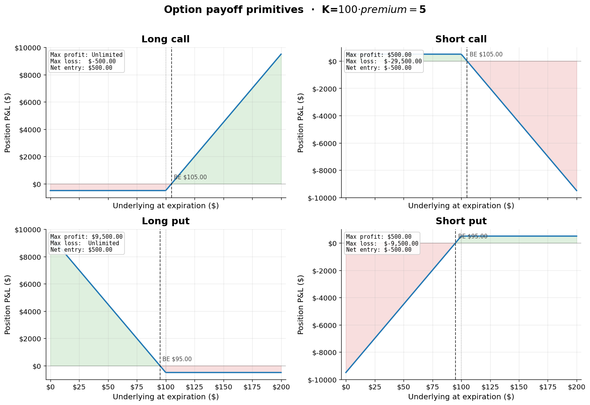
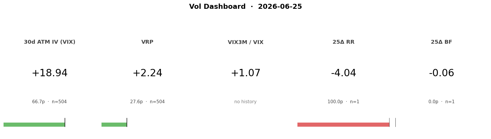
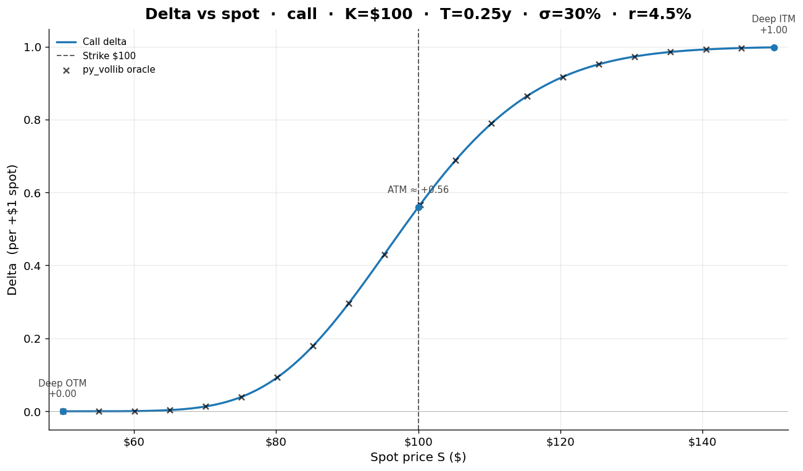
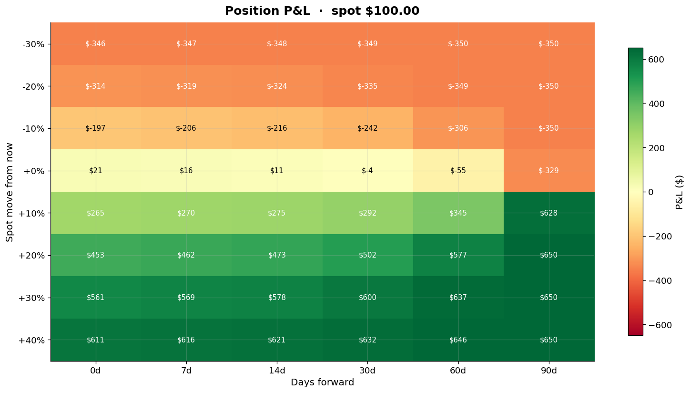

<h1 align="center">optionslab</h1>

<p align="center"><em>Options analytics for traders and learners — a clean Python library, a friendly CLI, and a Model-Context-Protocol server, all in one package.</em></p>

<p align="center">
  <a href="LICENSE"></a>
  <a href="https://www.python.org/downloads/release/python-3120/"></a>
  <a href="https://github.com/pradhann/options-chain-mcp/actions/workflows/ci.yml"></a>
  <a href="https://modelcontextprotocol.io"></a>
  <a href="https://github.com/astral-sh/ruff"></a>
  <a href="https://pradhann.github.io/options-chain-mcp/"></a>
</p>

<p align="center">
  <a href="https://pradhann.github.io/options-chain-mcp/">Documentation</a> ·
  <a href="USAGE.md">Quick reference</a> ·
  <a href="https://github.com/pradhann/options-chain-mcp/issues">Report a bug</a>
</p>

---

## Why optionslab

- **One model, three front doors** — a typed Python library, a verb-per-task CLI, and an MCP server that any Claude client can talk to.
- **The math you'd derive on paper** — vectorized Black-Scholes price + Greeks (Δ, Γ, Θ, V, ρ, vanna, vomma, charm), put-call parity checker, synthetic-position verifier. Every analytic Greek matches the `py_vollib` reference to 1e-6.
- **Position-first, not strategy-first** — a `Position` is just a list of legs. Payoff, value, Greeks, scenario grids, and metrics (max P / max L / breakevens) are all the same `Position` queried different ways.
- **Volatility as a market, not a number** — RV estimator zoo (close-to-close, Parkinson, Garman-Klass, Rogers-Satchell, Yang-Zhang), VRP, VIX term structure + regime label, 25Δ Risk Reversal / Butterfly, model-free VIX strip, event-implied move.
- **A daily Vol Dashboard** — five computed fields, two-year percentiles, one ritual.
- **Tested, typed, documented** — 50 pytest cases pinning the math. Every result is a dataclass with `.to_dict()` for clean JSON at the MCP/CLI edge.

## Install

```bash
pip install optionslab
```

Or, from source:

```bash
git clone https://github.com/pradhann/options-chain-mcp
cd options-chain-mcp
python -m venv .venv && source .venv/bin/activate
pip install -e ".[dev]"
```

## Quick start — Python

```python
from optionslab import Position, MarketContext
from optionslab.analysis import expiration_payoff, position_metrics, greeks

pos = Position.from_dicts([
    {"side": "long",  "option_type": "call", "strike": 100, "premium": 6.0},
    {"side": "short", "option_type": "call", "strike": 110, "premium": 2.5},
], name="bull-call-100-110")

expiration_payoff(pos, s_t=115).total_dollars   # 650.0
position_metrics(pos).breakevens                 # [103.5]

market = MarketContext.explicit(spot=105, r=0.045)
greeks(pos, market, ivs=0.30).delta_dollars      # ≈ $25 per +$1 in spot
```

## Quick start — CLI

```bash
# Live options chain with per-strike Greeks
optionslab chain --ticker SPY --near-money 6

# Closed-form metrics for an inline position
optionslab metrics --legs '[{"side":"long","option_type":"call","strike":100,"premium":6},
                            {"side":"short","option_type":"call","strike":110,"premium":2.5}]'

# The classic 2×2 payoff primitives chart
optionslab chart --kind primitives --strike 100 --premium 5 --save-plot primitives.png

# The daily Vol Dashboard
optionslab dashboard --save-plot dashboard.png
```

See [USAGE.md](USAGE.md) for the full one-page reference of every verb and chart kind.

## Quick start — MCP (Claude Desktop / Claude Code)

`optionslab` ships an MCP server so any Claude client can call its 40+ tools — pulling chains, valuing positions, drawing charts as inline images.

Add to your Claude config:

```json
{
  "mcpServers": {
    "optionslab": {
      "command": "python",
      "args": ["-m", "optionslab.mcp_server"]
    }
  }
}
```

Or, from a terminal Claude Code session:

```bash
claude mcp add optionslab -s user -- python -m optionslab.mcp_server
```

Restart Claude and ask things like *"pull the SPY chain at the nearest monthly and chart the 25Δ skew"* or *"build a bull call spread on AAPL and show me the P&L grid for ±20% over 30 days."*

## Screenshots

<table>
<tr>
<td align="center" width="50%"><b>Payoff primitives — Day 3 curriculum chart</b><br><sub>2×2 long/short × call/put, each annotated with breakeven and max P/L.</sub><br><br></td>
<td align="center" width="50%"><b>Vol Dashboard — the daily ritual</b><br><sub>Five fields with 2-year percentile bars: ATM IV, VRP, term ratio, 25Δ RR/BF.</sub><br><br></td>
</tr>
<tr>
<td align="center"><b>Delta sigmoid, with py_vollib oracle overlay</b><br><sub>Verified against the standard reference at every sample.</sub><br><br></td>
<td align="center"><b>Position scenario grid</b><br><sub>Dollar P&L over spot moves × days forward — heatmap of bull call spread, capped at $650 / floored at −$350.</sub><br><br></td>
</tr>
</table>

## What's inside

| Layer | Lives in | Purpose |
|---|---|---|
| Pricing | `optionslab.pricing` | Vectorized BS + all 8 Greeks + IV solver |
| Core types | `optionslab.core` | `Leg`, `Position`, `MarketContext`, typed `*Result` dataclasses |
| Data | `optionslab.data` | Quote, chain (with Greeks), events, vol fetchers |
| Analysis | `optionslab.analysis` | Payoff, valuation, metrics, scenario, parity, synthetics, **vol/** (VRP, term, skew, strip, event, dashboard) |
| Plotting | `optionslab.plotting` | Returns Matplotlib `Axes` / `Figure`; never calls `plt.show()` |
| Adapters | `optionslab.adapters` | Thin CLI + MCP + interactive shells over the analysis layer |
| Storage | `optionslab.storage` | `.optionslab/positions.json` + percentile history files |

Strict dependency direction: `pricing ← core ← analysis ← plotting ← adapters`. No cycles.

## Documentation

Full docs are published at **<https://pradhann.github.io/options-chain-mcp/>** (built with MkDocs Material from the [`docs/`](docs/) tree).

For a single-page reference of every verb, tool, and chart kind, see [USAGE.md](USAGE.md).

## Contributing

Issues and PRs welcome. To set up a dev environment:

```bash
git clone https://github.com/pradhann/options-chain-mcp
cd options-chain-mcp
python -m venv .venv && source .venv/bin/activate
pip install -e ".[dev]"
pytest                       # 50 tests, ~1 second
```

If you're fixing math, please add a test that pins the expected number. The repo's principle is *"breaking the math should fail a test before it ships."*

## License

[MIT](LICENSE) © Nripesh Pradhan
